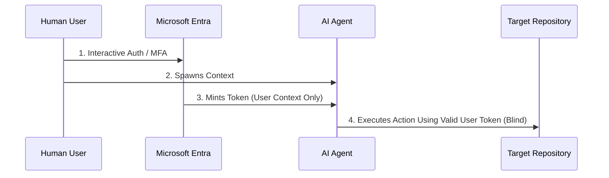

Enterprise adoption of agentic AI has outpaced the identity architecture meant to govern it. Microsoft 365 Copilot integrations, custom LLM workflows running over the Model Context Protocol (MCP), and cross-tenant AI connectors are now routinely acting inside production tenants — reading mailboxes, querying SharePoint, calling Graph API, executing workflows.

The assumption inside most security teams is that this is a solved problem. Standard OAuth delegation issues a token, the token carries scopes, the scopes are enforced. Job done.

It isn't done. The access token represents the human user's data footprint — what they're allowed to touch. It says nothing about whether the thing currently using that token is the human, a deterministic application, or an autonomous agent making decisions based on a prompt that could have been manipulated. Entra ID cannot see that distinction. The modern authorization graph has no native, unified concept of an agent executing an action on behalf of a human. That gap is what this post maps out.

## The Mechanics of the Gap

In a standard user-delegated authentication flow, an application requests an access token from the Microsoft identity platform containing scope claims (`scp`). Once granted, the resulting JWT establishes the security context entirely on the human subject (`sub`) — not on whatever is actually using the token downstream.

When an AI agent consumes this token to parse directories, extract files, or call APIs, the platform validates whether the human user is entitled to perform that action. It cannot validate whether the agent should be the one performing it.

Two things make the token plane blind to this distinction. First, context over-privilege: if an executive can access payroll data, any AI agent operating inside that executive's session inherits the same authority by default — there's no narrower scope available at the agent layer. Second, intent obfuscation: traditional applications make deterministic, hardcoded API calls, but AI agents act on dynamic prompt orchestration. Entra ID evaluates the token at issuance. It has no mechanism to evaluate whether the prompt driving the agent's next action was manipulated via injection to walk past a compliance boundary.

A few constraints worth knowing if you're trying to close this gap with what's available today: Workload Identity Conditional Access only governs the service principal's own authentication, with zero visibility into delegated user tokens the same agent might also be consuming. Continuous Access Evaluation revokes sessions on password reset, disable, or location shift — but not on agent behavior or prompt-level anomalies. Sign-in frequency controls shorten the exposure window for a delegated token, but they don't close it; the agent can still act freely within whatever window remains. And custom security attributes for tagging AI-integrated apps are only as good as your tenant's discipline in applying them consistently.

The failure mode that matters most here: a delegated token issued under a fully compliant, legitimate sign-in remains valid for its entire lifetime regardless of what the agent does with it afterward. There is no re-evaluation tied to agent-driven action.

## Where This Leaves Architects

Neither extreme response to this gap holds up in a real enterprise. Blocking delegated AI integrations entirely is a governance posture that lasts about 90 days before a business unit deploys Copilot anyway and you've lost visibility in the process. You don't win by saying no — you win by building the guardrails before the business runs past you.

But the architecturally correct answer — micro-segmented, app-specific permissions enforced at the API layer — is operationally brutal to deliver quickly. In a mid-size M365 tenant with 200+ app registrations already in various states of hygiene, retroactively scoping every integration to least-privilege API permissions is a 12-month program, not a control you can stand up this quarter. It's the right destination and a dishonest recommendation as an immediate fix.

The practical path is to instrument first and restrict second. Deploy Workload Identity Premium, get visibility into what your service principals and delegated integrations are actually doing, and establish a baseline. From there you can make a scoping argument grounded in real usage data instead of theoretical least-privilege. At the same time, push Conditional Access for workload identities as the nearest available approximation of dual-actor validation while Microsoft's authorization model matures.

The qualification that's easy to skip and important not to: these two controls — Workload Identity CA and user-side CA — operate on entirely different identity planes and don't talk to each other. Workload Identity CA governs the service principal's own authentication window. User-side CA governs the human's interactive session, which is already satisfied by the time the agent starts acting. The agent's subsequent actions ride that delegated token downstream with zero further evaluation, and Workload Identity Premium has no visibility into that delegated context. There is currently no native Entra control that asks whether the actor consuming a token right now is still the human who authenticated it.

That gap stays open regardless of how well you layer the available controls. The honest position is to say so plainly rather than presenting these two controls stacked together as a solved problem. The alternative — waiting for Microsoft to close this natively before acting — is the most dangerous option on the table. That's how a known, documented gap in 2026 becomes the subject of a breach post-mortem in 2028.

## Containment, Not Closure

Until native dual-actor token validation exists, the containment strategy is to combine controls across both planes to shrink the blast radius, not to close the gap outright.

On the user side, keep Continuous Access Evaluation universally active so sessions revoke instantly on password reset, account disable, or location shift, and reduce sign-in frequency for privileged users to 4-8 hour windows specifically for groups interacting with AI orchestration layers.

On the workload side, isolate AI app registrations as single-tenant service principals with explicit location boundaries enforced via Conditional Access for Workload Identities, and migrate background workloads to Azure Managed Identities wherever possible to eliminate standing client secrets and certificate export risk.

And structurally, tag AI-integrated applications with custom security attributes — something like `AI_Agent_Active` — so conditional policies and incident response playbooks can target exactly that population without touching unrelated app registrations.

None of this closes the authorization gap. It narrows the window and limits what's exposed inside it, which is the realistic ceiling on what's achievable until the platform itself catches up.

Mapped against MITRE ATT&CK, the relevant techniques are delegated token reuse beyond the original user's intent (T1550.001), prompt injection driving unauthorized downstream calls (adjacent to T1565), and standing credentials on AI service principals (T1078.004). The first two are partially mitigated by the controls above; the third is the one closest to a real fix today through Managed Identity migration.

Every AI integration running in production right now carries this gap whether anyone has acknowledged it or not. That's a manageable risk if it's a conscious decision backed by the compensating controls above. It's a different kind of risk entirely when nobody flagged it in the first place — and an inventory of AI-integrated app registrations against current Conditional Access coverage is the fastest way to find out which one you're carrying.

---
*Last validated: June 2026 against Entra ID Workload Identity Premium capabilities*