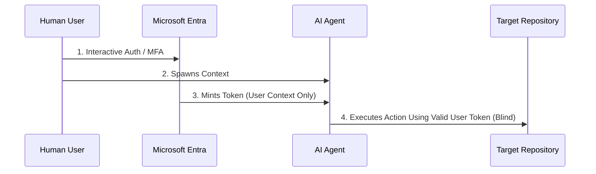

## TL;DR — What You Need Right Now

**Problem:** When an AI agent acts on behalf of a user, it rides the user's access token. Entra ID validates the user's permissions, but has no native way to evaluate whether the agent itself should be performing that action.

**Fix:** There is no single fix. The containment strategy combines Workload Identity Premium (for the agent's own service principal) with aggressive user-side Conditional Access (for the delegated token's exposure window). These two controls operate on different planes and do not cover each other — that gap is the point of this post.

**Time to implement:** Containment steps below take 1-2 days for a mature Entra tenant. The underlying gap has no native fix yet.

> **Jump to:** [The Mechanics](#technical-architecture--the-mechanics-of-the-gap) | [My Take](#the-operational-reality--my-take) | [Mitigation Playbook](#immediate-mitigation-playbook-for-architects) | [CISO Note](#ciso-advisory-note)

---

## Operational Context

Enterprise adoption of agentic AI has outpaced the identity architecture meant to govern it. Microsoft 365 Copilot integrations, custom LLM workflows running over the Model Context Protocol (MCP), and cross-tenant AI connectors are now routinely acting inside production tenants — reading mailboxes, querying SharePoint, calling Graph API, executing workflows.

The assumption inside most security teams is that this is a solved problem. Standard OAuth delegation issues a token, the token carries scopes, the scopes are enforced. Job done.

It isn't done. The access token represents the human user's data footprint — what they're allowed to touch. It says nothing about whether the thing currently using that token is the human, a deterministic application, or an autonomous agent making decisions based on a prompt that could have been manipulated. Entra ID cannot see that distinction. **The modern authorization graph has no native, unified concept of "an agent executing an action on behalf of a human."** That's the Authorization Gap, and it's why this post exists.

---

## Technical Architecture — The Mechanics of the Gap

In a standard user-delegated authentication flow, an application requests an access token from the Microsoft identity platform containing scope claims (`scp`). Once granted, the resulting JWT establishes the security context entirely on the human subject (`sub`) — not on whatever is actually using the token downstream.

When an AI agent consumes this token to parse directories, extract files, or call APIs, the platform validates whether the human user is entitled to perform that action. It cannot validate whether the agent should be the one performing it.

**Why the token plane is blind:**

- **Context over-privilege.** If an executive can access payroll data, any AI agent operating inside that executive's session inherits the same authority by default. There is no narrower scope available at the agent layer.
- **Intent obfuscation.** Traditional applications make deterministic, hardcoded API calls. AI agents act on dynamic prompt orchestration. Entra ID evaluates the token at issuance — it has no mechanism to evaluate whether the prompt driving the agent's next action was manipulated via injection to walk past a compliance boundary.

---

## Engineering Constraints & Edge Cases

| Constraint | Condition | Why it matters |
|---|---|---|
| Workload Identity CA scope | Only governs the service principal's own authentication | Has zero visibility into delegated user tokens the agent is also consuming |
| Continuous Access Evaluation (CAE) | Revokes on critical events (password reset, disable, location shift) | Does not revoke based on agent behavior or prompt-level anomalies |
| Sign-in frequency controls | Caps token lifetime at re-authentication intervals | Shortens the exposure window but does not close it — the agent can still act freely within that window |
| Custom security attributes | Manual tagging effort required | Only as good as your tenant's discipline in tagging every AI-integrated app registration |

**Known failure mode:** A delegated token issued under a legitimate, compliant sign-in is fully valid for its entire lifetime — regardless of what the agent does with it after issuance. There is no re-evaluation tied to agent-driven action.

---

## The Operational Reality — My Take

Neither extreme is the right answer, and any architect recommending either one isn't operating in a real enterprise.

Blocking delegated AI integrations entirely is a governance posture that lasts about 90 days before a business unit deploys Copilot anyway and you've just lost visibility. You don't win by saying no — you win by being the person who built the guardrails before the business ran past you.

But micro-segmented, app-specific permissions at the API layer is architecturally correct and operationally brutal. In a mid-size M365 tenant with 200+ app registrations already in various states of hygiene, telling someone to retroactively scope every integration to least-privilege API permissions is a 12-month program, not a control. It's the right destination but a dishonest recommendation as an immediate fix.

The actual practitioner answer: you instrument first, restrict second. Deploy Workload Identity Premium, get visibility into what your service principals and delegated integrations are actually doing, and establish a baseline. Then you can make a scoping argument grounded in real usage data rather than theoretical least-privilege. Simultaneously, push for Conditional Access policies for workload identities as the nearest available approximation of dual-actor validation while Microsoft's authorization model matures.

Here's the qualification a senior reviewer will look for, and the one most architects skip: **these two controls operate on entirely different identity planes and do not talk to each other.** Workload Identity CA governs the service principal's own authentication window. User-side CA governs the human's interactive session. When an AI agent uses a delegated token, the user's CA policy was already satisfied at sign-in — the agent's subsequent actions ride that token downstream with zero further evaluation. Workload Identity Premium has no visibility into that delegated context. There is currently no native Entra control that asks "is the actor consuming this token right now still the human who authenticated it?"

The dual-actor validation gap remains open. Architects need to say that plainly rather than presenting these two controls stacked together as a solved problem. The "wait for Microsoft to solve it natively" position is the most dangerous of all — that's how you end up in a 2028 breach post-mortem where someone notes the gap was known and documented in 2026.

---

## Immediate Mitigation Playbook for Architects

Until native dual-actor token validation exists, the containment strategy is to combine controls across both planes to reduce blast radius — not to close the gap, but to shrink it.

**Step 1 — Maximize user-side session freshness**

- **Continuous Access Evaluation (CAE):** keep it universally active so sessions revoke instantly on password reset, account disable, or location shift.
- **Sign-in frequency controls:** reduce token lifetimes for privileged users to 4-8 hour windows specifically for groups interacting with AI orchestration layers.

**Step 2 — Establish workload identity perimeters**

- **Single-tenant service principals:** isolate AI app registrations and enforce explicit location boundaries via Conditional Access for Workload Identities.
- **Managed identities over secrets:** migrate background workloads to Azure Managed Identities wherever possible, eliminating standing client secrets and certificate export risk.

**Step 3 — Enforce structural application filters**

- Tag AI-integrated applications using custom security attributes (e.g., `AI_Agent_Active`) so you can target conditional policies and incident response playbooks at exactly that population without touching unrelated app registrations.

---

## Threat Register Mapping

| Threat Vector | MITRE ATT&CK | Control This Addresses |
|---|---|---|
| Delegated token reuse by autonomous agent beyond user intent | T1550.001 | Sign-in frequency + CAE shrink the exposure window |
| Prompt injection driving unauthorized downstream API calls | T1565 (adjacent) | Application tagging enables targeted incident response, not prevention |
| Standing credentials on AI service principals | T1078.004 | Managed Identity migration removes exportable secrets |

---

## CISO Advisory Note

The business risk here isn't theoretical — it's a timing problem. Every AI integration deployed today is operating with a known, documented gap in dual-actor validation. That's an acceptable risk to carry *if* it's a conscious decision with compensating controls in place. It's an unacceptable risk to carry by default because no one flagged it.

**Recommended ask:** request a current inventory of AI-integrated app registrations and their Conditional Access coverage today. If Workload Identity Premium isn't licensed, that's a budget conversation worth having before your AI footprint grows further — not after an incident makes the case for you.

---

## References & Further Reading

- Microsoft Learn — Conditional Access for workload identities
- Microsoft Learn — Continuous Access Evaluation overview
- MITRE ATT&CK — Use of Alternate Authentication Material

---
*Filed under: Machine Identity, Zero Trust | Depth: Architecture, CISO Advisory*
*Last validated: June 2026 against Entra ID Workload Identity Premium capabilities*